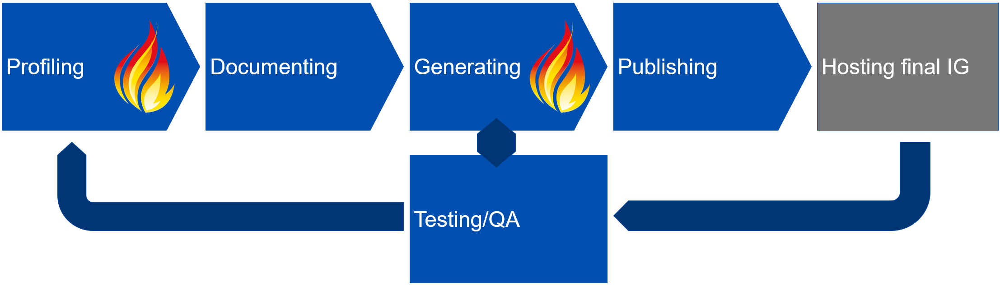

# FHIR build pipeline

 The main goal of this guide is to show how you can generate an implementation guide from FHIR-profiles and other conformance resources defined for your FHIR project. The implementation guide should document how to implement a client and/or a server that is to integrate to your FHIR implementation and what semantic requirements the client/server should conform to.  

   

**Profiling** To make a FHIR implementation guide you first have to define the conformance resources that defines the semantic rules of you implementation. This step is called [Profiling](https://www.hl7.org/fhir/profiling.html) and usually produce a number for FHIR conformance resources either in the form of XML/JSON or SUSHI FSH files.  

**Documenting** To make an Implementation Guide readable for humans you have to explain the use-case(s) your implementation supports and how the conformance resources are used to achieve interoperability supporting the use-case(s). This step is called documenting and the end result is usually a number of assets descriping the use-cases and how your FHIR conformance resources are used in an actual implementation. The assets are usually images and text that can be structured into a human readable document (usually a number of html pages).  

**Generating** To generate the actual FHIR implementation guide, the FHIR tooling can generate static html pages that consists of all you conformance resources and all the documentation generated in the Documenting step. The end result is a number of html pages that can be published on the internet.

**Testing and QA** The generated FHIR IG should be available as a CI build to be read by human beings and tested in implementations in order to ascertain the quality of the documentation and the proposed conformance resources. The four steps Profiling, Documenting, Generating and Testing and QA could be repeated any number of times before achieving an IG ready for publication.

**Publishing** The finished implementation guide after generation and testing could then be hosted on you preferred web hosting site as a finished version of the Implementation Guide. When you have a established a version of the IG that are ready for release you can publish this as a static version of the IG and register the generated FHIR package in the [FHIR package registry](https://registry.fhir.org/). The Published version of the implementation guides SHOULD be hosted on the same url as the defined canonical for the ImplementationGuide. The Implementation Guide and the FHIR conformance resources must have a version.

## Further development of the IG

After publishing further input from implementing and testing should be adressed in a new develop cycle for the Implementation Guide. Another cycle of the build pipleline should produce an updated Implementation Guide with a new version of the IG and the conformance resources.

## Tools for building

In this guide we focus on setup and use of the official HL7 IG Publisher for generating FHIR implementation guides.

### Setup repository for a FHIR Implementation guide

This guide describes two ways for building your Implementationguide using HL7 IG publisher. No matter what build process you choose you need to setup a repository for you IG source files (if you use the local build option you could choose to store all files on your local computer, but the use of source control tool is highly recommended and makes it easy to make you IG readable by the public).

### Setup your GitHub repo

You will need a *gh-pages* branch to contain the files produced from you IG build process.

#### Create an orphan gh-pages branch

To create the orphan gh-pages branch (based on instructions from Hugo, siste linje kan være enten main eller master avhengig av repository oppsettet ditt):

~~~bash
git checkout --orphan gh-pages  
git reset --hard  
git commit --allow-empty -m "Initializing gh-pages branch"  
git push origin gh-pages  
git checkout master  
~~~

Once the branch is pushed to GitHub, you have to go to the Settings page of the repository. In the section “GitHub Pages”, select gh-pages as the source. If successful, you will see a message saying:

~~~text
“Your site is published at https://your-username.github.io/your-repository/”.
~~~

Clone the gh-pages branch to a catalog on your local drive (e.g. "gh-pages") and clone the master branches to a separate directory locally (e.g. "master"). The "gh-pages" catalog is where you store all the files from the IG-generation "output" directory. The "master" directory is where you develop and store the artifacts for your IG and the directory that you point IG-publisher for input files to generate the IG.

#### Action script permission

If you plan to use a CI building using an action scrip like [this](#running-ig-publisher-as-a-github-workflow) you also have to add permission for pushing code using action scripts in the repo settings. (Actions->General->Workflow permission)

### Make an ImplementationGuide

In a separate folder under "igs", define your IG and the FHIR artifacts (profiles, extensions etc.). Artifacts goes in the input folder.  FHIR artifacts can be converted from xml/json to FSH or written by hand using the FSH language.

You need three files to get started with IG build process:

* ig.ini - Defines the template for the IG and where the generated ImplementationGuide resouces is to be found.
* sushi-config.yaml - Defines configuration for your implementation guide to the SUSHI IG generation part of the IG-Publisher
  * sushi-config.yaml should contain references to any documentation pages you make in the input/pages folder
* input/pages/index.md - The starting page of your implementation guide, usually written i markdown
  * The input/pages folder can contain any number of markdown files to display as part of you implementation guide
* package-list.json - is recommended to keep track of published versions of your IG

The actual FHIR definitions ([FHIR Shorthand](https://fshschool.org/docs/)) goes into the fsh folder, full writeup of the catalog structure for [IG-generation](https://fshschool.org/docs/sushi/project/#ig-projects):

* input/fsh/* - All the fsh files defining your FHIR artifacts (profiles, search parameters, codesystems etc.)

An alternative to writing the FHIR definition using FHIR Shorthand you can provide XML or JSON definitions directly or generated from other tools like [Forge](https://fire.ly/products/forge/) or [Trifolia on FHIR](https://trifolia-fhir.lantanagroup.com/lantana_hapi_r4/home). You can also mix FSH and XM/JSON input:

* XML or JSON input is placed in the input folder with [appropriate folder names](https://build.fhir.org/ig/FHIR/ig-guidance/using-templates.html#igroot-input)

**NOTE!**  
> IG publisher needs an implementation guide resource to run. If you use fsh to define your conformance resources an implementation guide resource will be provided by sushi. However if you choose to make a conformance resources strictly using json/xml an implementation guide resource will not be provided by sushi. To fix this, you can either add a single fsh file to invoke sushi as a part of the build process or provide an implementation guide resource for IG publisher.

### Next step

When the source files are written in you IG repository you are ready to run IG publisher and generate an actual FHIR IG. You can choose two (or three) ways to generate a version of you IG:

* Run the publisher as a Github-workflow
* Run the publisher installation on your local computer ([using a docker image is described here](https://github.com/thomiz/build-pipeline#running-ig-publisher-as-a-local-docker-image))

A third option is to setup a webhook to run the [HL7 auto build process](https://github.com/FHIR/auto-ig-builder)

## Running IG-publisher as a Github-workflow

When we set up a build environment using Github-workflow we make a yaml script that uses several prebuilt tools to build the implementation-guide and deploying this to a github-pages environment for review. We use a HL7 generated docker image containing the FHIR build pipeline that handles any FHIR conformance resources for building a FHIR implementation guide.

### Setup a CI GitHub workflow

To use this build pipeline you have to make a script to run the IG-publisher and other necessarry jobs to build and deploy the Implementation Guide.

### IG build yaml script

The build script is added in the **.github/workflows** directory of your Github repository. When the script is added to the main/master branch of your project it will apear under the **Actions** tab of you repo for manual run and status messages. The script can also be made to run automatically on commits to master or any other automation available through [Github-Actions](https://docs.github.com/en/actions).  
We are using a clone of the auto builder made my [HL7 Belgium](https://github.com/hl7-be/tutorial_ig/blob/master/.github/workflows/main.yml) with some [modifications](https://github.com/HL7Norway/VkpObservation/blob/master/.github/workflows/vkpobservation-gh-pages.yml).  
The script should be self explanatory with ample use of comments to describe the actual workings of the action script.

### Output

The running of the actual build process using the Github action should take 2-10 minutes dependent on the size of the Implementionguide. A successfull/unsuccessful run should be documented under the **Action** tab. The output from the script (the actual html rendered Implementation guide is available as html files in the **gh-pages** branch and can be accessed like this:

* [VkpObservation Implementation Guide](https://hl7norway.github.io/VkpObservation/currentbuild/)

## Running IG-publisher as a local docker image

Alternatively to running the IG-publisher as a Github-Workflow you can install it locally and run it on your own hardware.

To run the Docker images, install Docker, a personal license should suffice.
[Docker](https://www.docker.com/get-started)

### Build Docker image

Build a docker image using the vscode task or command-line:

~~~bash
docker build -t [your docker image name here] .
~~~

The docker image settings is contained in the "Dockerfile" configuration file of the repo. The docker file defines how to build a docker image to run the FHIR validator, IG Publishing and SUSHI, including all dependencies. An alternative to run docker is to install these applications on your local computer, but it is easier to maintain a docker image with all dependencies installed.

### Run SUSHI

To generate an ImplementationGuide.json and a menu.xml file for IG-publisher you need to rund SUSHI. Any fsh artifacts will also be generated an placed in the fsh-generated directory as a result of this run.

~~~bash
docker run --rm -v e:\GitRepo\test-IG\master\igs\test-IG:/data thomiz/fhir-build sushi /data
~~~

After the first run, the IG-publisher will update the ImplementationGuide.json file for you, but you can not run the IG-publisher the first time around without an ImplementationGuide Resource definition.

### Run the IG-publisher

When you have created the necessary files you can run the IG-publisher to generate an actual implementation guide.

~~~bash
docker run -it --rm -v package-cache:/root/.fhir -v [ig directory]:/data [name of docker image] publisher -ig /data/ig.ini
~~~

### Publish the IG on the web

The contents in the "output" folder can be copied into the "gh-pages" folder. As soon as the contents is checked in to the GitHub repo you should have a IG page published on your github.io site.

## Publish and hosting

When an FHIR IG has undergone QA and processess defined by your organisation for publishing a formal working version of the IG, you should host the IG on a static URL consistent with the canonical URL defined for your IG. The process for doing so is described by HL7.

* [Maintaining a FHIR IG Publication](https://confluence.hl7.org/display/FHIR/Maintaining+a+FHIR+IG+Publication)

### Publishing a version

What steps are part of the publication of a new version of the IG.  
**TODO**

### Version information in the IG

Update the package_list.json file with information about the new version of the IG.  
**TODO**  

### Maintaining multiple versions of the IG

The work steps included in maintaining multiple versions of the IG.
**TODO**

## Other build tools for IG generation

SIMPLIFIER and Trifolia are other possible solutions for generating FHIR implementation guides.

## Projects and documentation

* NEW 2022-01-11 [Maintain FHIR IG publication](https://confluence.hl7.org/display/FHIR/Maintaining+a+FHIR+IG+Publication)
* [FSH/SUSHI School](https://fshschool.org/docs/)
* [Guidance for FHIR IG Creation](http://build.fhir.org/ig/FHIR/ig-guidance/index.html)
* [NAV's writeup of the buildprocess](https://github.com/navikt/fhir)
* [The official HL7 auto IG builder](https://github.com/FHIR/auto-ig-builder)
* [Dockerized build image for IG publisher](https://github.com/NIH-NCPI/hl7-fhir-ig-publisher)
* [IG release pipeline walkthroug (HL7 Belgium)](https://github.com/hl7-be/fhir-ig-release-publication)
* [An important script for the GitHub workflow](https://github.com/hl7-be/tutorial_ig/tree/master/.github/workflows)
* [Docker build alternative](https://github.com/logicahealth/fhir-ig-base)
  * [The actual Docker image for download](https://hub.docker.com/r/logicahealth/fhir-ig-base)
